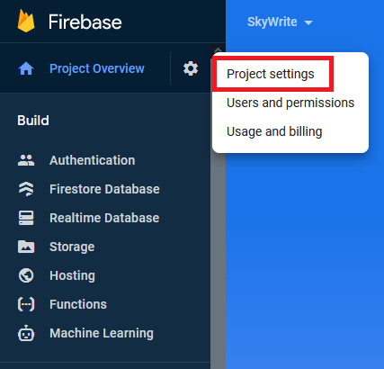
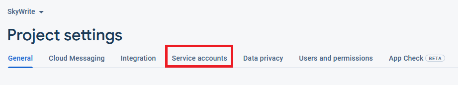
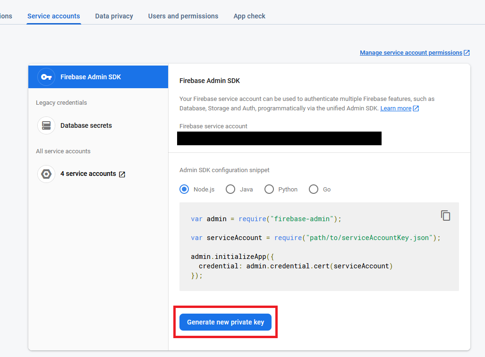

# 2021-ARMessaging - SkyWrite #
## Summary ##
SkyWrite is an Android app that will allow a sender to select an appropriate message (eg Happy Birthday,
Merry Christmas etc) to a postcode. The message will appear in augmented reality 100ft above the ground.
Those with the app/service will be notified that a message exists in a nearby postcode.

You can read more about the development in our [blog](https://sky-write.github.io/)

## User Guide ##
### How to run ###
1. Make sure you have a [compatible](https://developers.google.com/ar/devices) mobile device
1. Download the apk file
2. Navigate to Settings and make sure to give permissions to install unknown apps from unknown sources
3. Locate the apk file in your files and tap on it to install it
4. Open the app and accept all permissions - if you do not have Google Play Services for AR installed already, SkyWrite will ask you to install it

## Developer Guide ##

### Prerequisites ###
- Java 11
- Gradle
- Android Studio

### Set up ###
1. Install the prerequisites
2. Clone the repository: `git clone git@github.com:spe-uob/2021-ARMessaging.git`

## Getting Started ##
This project uses the Gradle build system. To build the project use `gradlew build` in the terminal or import the project in Android Studio.

To run tests, run `gradlew test` or navigate to the tests on Android Studio and run from there.

It is recommended to run the app using the [Android Emulator](https://developer.android.com/studio/run/emulator) but it is also possible to run the app on a [hardware device](https://developer.android.com/studio/run/device).

## Watson Text-to-Speech ##
SkyWrite uses Watson Text-to-Speech (Lisa voice). To create your own audio files using Watson Text-to-Speech, make sure you have [curl](https://github.com/curl/curl) installed and follow the instructions below:

1. Navigate to the IBM Cloud Catalogue and click on the menu in the top-left corner
2. Scroll down until you see `Watson` and click on it
3. Scroll down until you see `Watson Text-to-Speech` and click on it
4. Configure and create your resource
5. You will be directed to the `Getting Started` page. On there, click on the `Manage` tab on the left column
6. Copy your API key and the URL
7. Use the following command in your terminal, and replace the API key and the URL with the ones you copied previously:
   1. On Windows:
   
            curl -X POST -u "apikey:{apikey}" ^
            --header "Content-Type: application/json" ^
            --header "Accept: audio/wav" ^
            --data "{\"text\":\"hello world\"}" ^
            --output hello_world.wav ^
            "{url}/v1/synthesize?voice=en-US_MichaelV3Voice"

   1. On Mac/Linux:
   
            curl -X POST -u "apikey:{apikey}" \
            --header "Content-Type: application/json" \
            --header "Accept: audio/wav" \
            --data "{\"text\":\"hello world\"}" \
            --output hello_world.wav \
            "{url}/v1/synthesize?voice=en-US_MichaelV3Voice"

For more information, refer to the guide found in `Getting Started`

## Deployment ##
### Client-side Deployment ###
Since the front-end is an Android App, deployment is done via APK release. The CircleCI script includes a `release-build` which updates with every push to the `master` branch and produces an APK. Our website below contains a table of previous APK releases made during development.
##### Via Android Studio #####
If you want to build an APK from Android Studio, Android Studio documentation for release builds can be found here: https://developer.android.com/studio/run.

##### Via command line #####
If you want to build an APK from the command line, use one of the following commands:
- Windows: `gradlew TASK-NAME`
- Mac/Linux: `./gradlew TASK-NAME`

Common build tasks are:
- `assembleRelease` - for release builds (NOTE: To create a release build, you will need to sign your app with your private key. This can be done by following the instructions [here](https://developer.android.com/studio/build/building-cmdline#sign_cmdline)
- `assembleDebug` - for debug builds

More information can be found here: https://developer.android.com/studio/build/building-cmdline

### Server-side Deployment ###
Server-side deployment is recommended through IBMCloud and a Kubernetes toolchain, which can be set up using the Dockerfile and shell script provided.

Alternatively, a local environment can be set up for personal development; the SpringBoot server running on localhost with a connection to a local PostgreSQL server will suffice.

To use your own database, update the current `BASE_URL` found in `App/app/src/main/java/.../util/database/ServiceGenerator`

## Firebase Cloud Messaging (FCM) #
[Firebase Cloud Messaging (FCM)](https://firebase.google.com/docs/cloud-messaging) is a Push Notification service that allows a server to send notifications to the users.

If you want to set up Firebase Cloud Messaging for personal use, read the following:

### Client-side Set Up ###
SkyWrite has the `NotificationFCMService` class which handles incoming messages from the server and displays the relevant notifications, and so you do not need to modify any code. However, if you use a different package name to `com.ajal.arsocialmessaging` you will need to connect Firebase to your app. To do this, follow the instructions here: https://firebase.google.com/docs/android/setup

### Server-side Set Up ###
To set up server-side you will need to first need to create a project on Firebase, if you haven't already done so.

The follow the steps to retrieve your configuration file with your service account's credentials:
1. In your project overview, look at the top-right corner, select the cog next to `Project Overview`, then click on `Project Settings`. 
2. Click on `Service Accounts` at the top 
3. Click `Generate new private key` to retrieve your service account key 

Once you have acquired the service account key file, update the current `service-account-file.json` to the new json file that you have acquired.

## Blog ##
Our [blog](https://sky-write.github.io/) contains all the documentation as well as updates on the development process.
